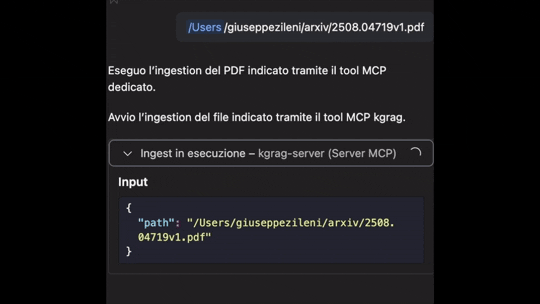

# KGrag MCP Server

**KGrag MCP Server** is a server that implements the [Model Context Protocol (MCP)](https://modelcontextprotocol.io/) for managing, ingesting, and querying structured and unstructured data.
It is designed for easy integration with graph databases (Neo4j), AWS S3 storage, Redis cache, vector search engines (Qdrant), and advanced language models (LLM).  
The project provides a scalable, containerized infrastructure via Docker Compose to orchestrate data pipelines, semantic enrichment, and analysis through advanced queries.  
Ideal for knowledge graph, AI, and information flow automation applications.

## Example: Ingestion and Query with GitHub Copilot in VSCode (Agent Mode)

You can use GitHub Copilot in VSCode to interactively ingest documents into the MCP Server using an agent-based workflow and a configuration file.

**Step-by-step:**

1. **Open VSCode** and ensure GitHub Copilot is enabled.
2. **Create an `mcp.json` configuration file** in your project directory:

```json
{
	"servers": {
		"kgrag-server": {
			"url": "http://localhost:8000/sse",
			"type": "sse"
		}
	},
	"inputs": []
}
```

3. **Let Copilot suggest ingestion code and improvements** such as error handling or batch processing, using the configuration from `mcp.json`.

This workflow enables rapid prototyping and automation of ingestion tasks with Copilot's agent capabilities and a configurable server endpoint.



---

## Dependencies

- [`kgrag-store`](https://github.com/gzileni/kgrag-store): Core data storage and graph management library.
- [`memory-agent`](https://github.com/gzileni/memory-agent): A Python library for advanced memory management in AI agent applications

---

## [Development](DEV.md)

---

## **Tools**

### `query`

Queries the **Knowledge Graph** to obtain answers based on stored documents and relationships.

**Parameters**:

* `query` (`str`) → Question to ask the graph.

### `ingestion`

Ingests a document from the file system into the graph.

**Parameters**:

* `path` (`str`) → Path to the file to ingest.


###  `extract_graph_data`

Extract graph data from a document using the KGraph system

**Parameters**:

* `raw_data` (`str`) → Raw data to process.

###  `parser`

Parse a document using the KGraph system.

**Parameters**:

* `text` (`str`) → Text to be parsed.

---

## **Prompts**

### 📜 `parser_text_prompt`

Generates the **prompt** to extract relationships from text.

```python
@mcp.prompt(title="Parser Text Prompt")
def parser_text_prompt(text: Optional[str] = None) -> str:
```

### 🤖 `agent_query_prompt`

Generates the **prompt** to answer graph-based queries.

```python
@mcp.prompt(title="Agent Query Prompt")
```

Uses the `AGENT_PROMPT` constant and formats data from:

* `nodes_str` → list of nodes
* `edges_str` → list of relationships
* `user_query` → user question

---

## Docker

To run the MCP Server using Docker Compose, follow these steps:

1. **Create a `docker-compose.yml` file**  
    Add the following configuration to your project directory:

    ```yaml
    services:
      kgrag-mcp-server:
         container_name: kgrag_mcp_server
         restart: always
         image: ghcr.io/gzileni/kgrag_mcp_server
         ports:
            - "8000:8000"
         networks:
            - kgrag-network
         environment:
            - APP_ENV=${APP_ENV}
            - LLM_MODEL_TYPE=${LLM_MODEL_TYPE}
            - OPENAI_API_KEY=${OPENAI_API_KEY}
            - AWS_ACCESS_KEY_ID=${AWS_ACCESS_KEY_ID}
            - AWS_SECRET_ACCESS_KEY=${AWS_SECRET_ACCESS_KEY}
            - AWS_REGION=${AWS_REGION}
            - AWS_BUCKET_NAME=${AWS_BUCKET_NAME}
            - COLLECTION_NAME=${COLLECTION_NAME}
            - VECTORDB_SENTENCE_TYPE=${VECTORDB_SENTENCE_TYPE}
            - VECTORDB_SENTENCE_MODEL=${VECTORDB_SENTENCE_MODEL}
            - VECTORDB_SENTENCE_PATH=${VECTORDB_SENTENCE_PATH}
            - NEO4J_USERNAME=${NEO4J_USERNAME}
            - NEO4J_PASSWORD=${NEO4J_PASSWORD}
            - NEO4J_AUTH=${NEO4J_AUTH}
            - NEO4J_URL=${NEO4J_URL}
            - REDIS_URL=${REDIS_URL}
            - REDIS_HOST=${REDIS_HOST}
            - REDIS_PORT=${REDIS_PORT}
            - REDIS_DB=${REDIS_DB}
            - QDRANT_URL=${QDRANT_URL}
            - LLM_MODEL_NAME=${LLM_MODEL_NAME}
            - MODEL_EMBEDDING=${MODEL_EMBEDDING}
            - LLM_URL=${LLM_URL}
    networks:
      kgrag-network:
         name: kgrag-network
         driver: bridge
         ipam:
            driver: default
            config:
              - subnet: 172.16.99.0/24
    ```

2. **Set environment variables**  
    Create a `.env` file in the same directory and define all required variables (e.g., `APP_ENV`, `OPENAI_API_KEY`, etc.).

3. **Start the MCP Server**  
    Run the following command in your terminal:

    ```bash
    docker compose up -d
    ```

This will launch the MCP Server on port `8000` and connect it to the `kgrag-network` bridge.  
You can now access the server and its services as configured.


