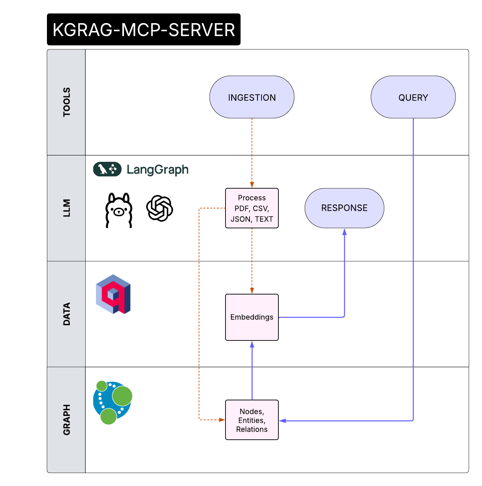

[](https://github.com/gzileni/kgrag_mcp_server)
[](https://github.com/gzileni/kgrag_mcp_server/stargazers)
[](https://github.com/gzileni/kgrag_mcp_server/network)




**KGrag MCP Server** is a server that implements the [Model Context Protocol (MCP)](https://modelcontextprotocol.io/) for managing, ingesting, and querying structured and unstructured data.
It is designed for easy integration with graph databases (Neo4j), AWS S3 storage, Redis cache, vector search engines (Qdrant), and advanced language models (LLM).  
The project provides a scalable, containerized infrastructure via Docker Compose to orchestrate data pipelines, semantic enrichment, and analysis through advanced queries.  
Ideal for knowledge graph, AI, and information flow automation applications.

## Example: Ingestion and Query with GitHub Copilot in VSCode (Agent Mode)

You can use GitHub Copilot in VSCode to interactively ingest documents into the MCP Server using an agent-based workflow and a configuration file.

**Step-by-step:**

1. **Open VSCode** and ensure GitHub Copilot is enabled.
2. **Create an `mcp.json` configuration file** in your project directory:

```json
{
	"servers": {
		"kgrag-server": {
			"url": "http://localhost:8000/sse",
			"type": "sse"
		}
	},
	"inputs": []
}
```

3. **Let Copilot suggest ingestion code and improvements** such as error handling or batch processing, using the configuration from `mcp.json`.

This workflow enables rapid prototyping and automation of ingestion tasks with Copilot's agent capabilities and a configurable server endpoint.

---

## Dependencies

- [`memory-agent`](https://gzileni.github.io/memory-agent): A Python library for advanced memory management in AI agent applications

---

## [Development](DEV.md)

---

## **Tools**

### `query`

Queries the **Knowledge Graph** to obtain answers based on stored documents and relationships.

**Parameters**:

* `query` (`str`) → Question to ask the graph.

### `ingestion`

Ingests a document from the file system into the graph.


**Parameters**:

* `path` (`str`) → Path to the file to ingest.

---

## [Docker](./docker/README.md)